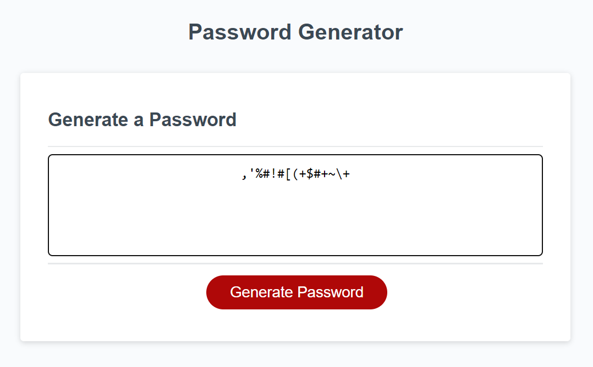

# Strong Password Generator

This site will generate password that would meet most requirements of the sites, where password should be used for login purposes

## Screenshot

## Description

User will chose the length of the password. 
if length entered is less than 10 or more than 64, 
user will have to re-enter, due to the securoty reasons.

User will be also able to chose security fetures of the generated password, ie shuld it include:

- lowercase characters
- uppercase characters
- numeric characters
- special characters

## Getting Started

Live version of the app can be loaded from the 
Github pages:
https://mihacuo.github.io/PasswordGenerator/

### Dependencies

Any modern web browser

### Installing

This app is run from the url
https://mihacuo.github.io/PasswordGenerator/

### Executing program

Click butten "generate password"
Follow promts and respond to chose the length of the password 
and the security options

## Help

contact author at
mihhail.odnolko@gmail.com

## Authors

Contributors names and contact info

Aleksandr Riabov
https://github.com/AleksandrRiabov

## Version History

* 1.0
    * Initial release

## License

This project is licensed under the [Password Generator] License - see the LICENSE.md file for details

## Acknowledgments

JavaScript tutorials were extensively researched at:
https://www.w3schools.com/js/default.asp